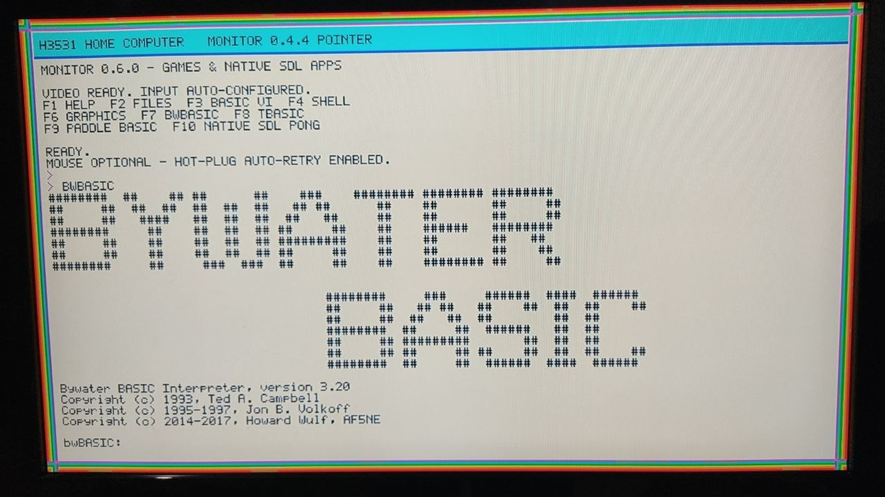
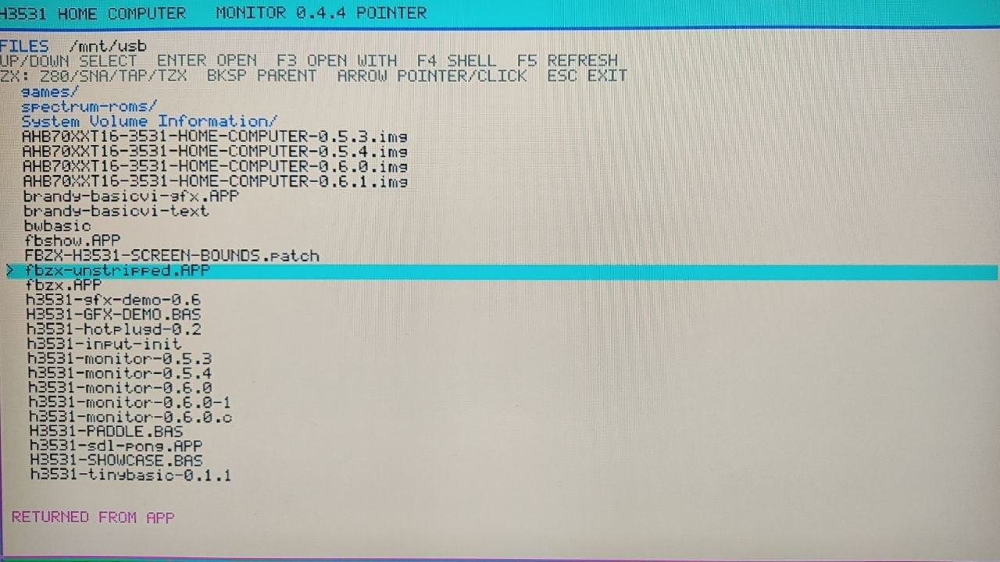
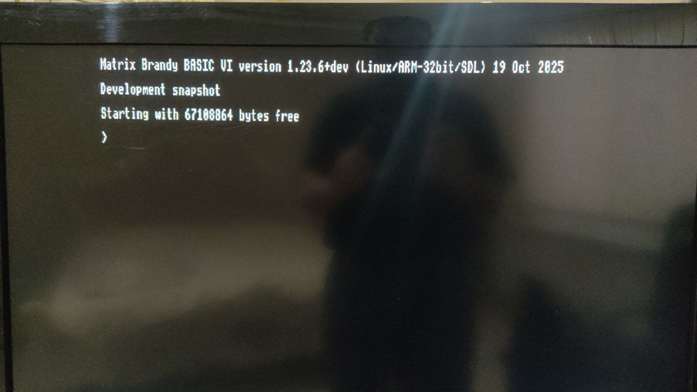
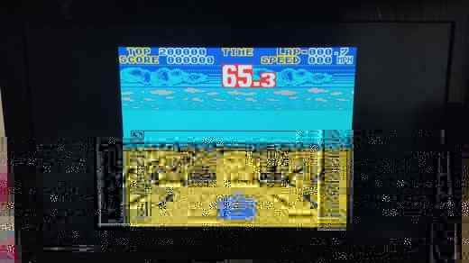
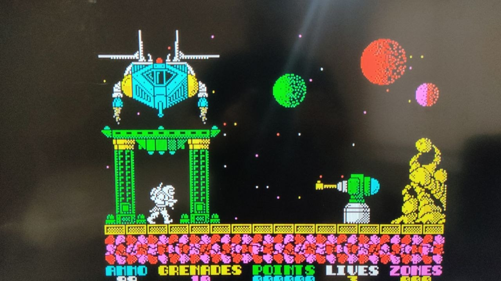
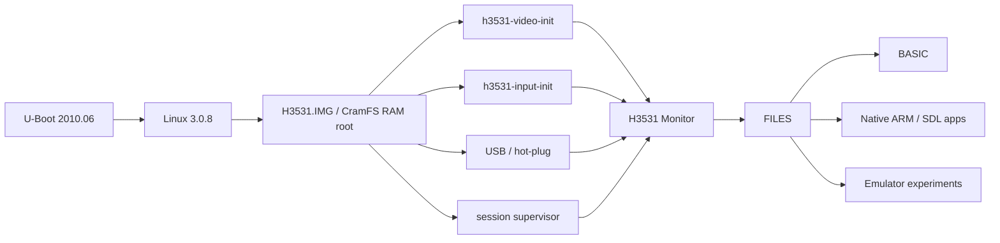

<div align="center">

# H3531 Home Computer

**Старый DVR на HiSilicon Hi3531 как экспериментальный домашний Linux-компьютер**


<p>
  <a href="docs/articles/h3531-home-computer-ru.md"><b>История проекта</b></a> ·
  <a href="docs/quickstart-v0.7-fbzx-z80-ru.md"><b>Быстрый запуск</b></a> ·
  <a href="docs/AHB70XXT16-3531_Hi3531_Technical_Documentation_RU_v3.docx"><b>Техническая документация v3</b></a> ·
  <a href="docs/releases/v0.7-fbzx-z80-demo.md"><b>v0.7 demo</b></a>
</p>

<a href="docs/images/monitor-bwbasic.jpg">
  
</a>

<sub>H3531 Monitor и Bywater BASIC на реальном устройстве. Нажмите на фотографию, чтобы открыть оригинал.</sub>

</div>

## О проекте

**H3531 Home Computer** — эксперимент по превращению морально устаревшего видеорегистратора на HiSilicon Hi3531 в небольшую самостоятельную компьютерную среду.

Цель проекта — не сделать «ещё один ZX Spectrum». Мы строим универсальную среду: безопасная USB/RAM-загрузка, собственный Monitor и файловый менеджер, BASIC, нативные ARM/SDL-приложения и эксперименты с эмуляторами разных старых систем.

Важная часть эксперимента — использование современных AI-инструментов как технического помощника: для анализа загрузки, Linux, framebuffer, SDL, исходного кода и ошибок. При этом окончательная проверка всегда происходит на реальной плате.

## Что уже работает

| Подсистема | Состояние |
|---|---|
| Linux 3.0.8 / ARMv7 | ✅ физически проверено |
| HDMI/VGA через HiSilicon VOU/HIFB | ✅ физически проверено |
| `/dev/fb0`, 1280×720, ARGB1555 | ✅ физически проверено |
| USB keyboard / mouse / storage / hub | ✅ физически проверено |
| H3531 Monitor + FILES | ✅ работает |
| Tiny BASIC / Bywater BASIC | ✅ работает |
| Matrix Brandy BASIC VI | ✅ графический режим работает |
| Custom SDL 1.2 backend | ✅ работает на реальной плате |
| Native ARM/SDL приложения | ✅ работают |
| FBZX 3.1.0 | ✅ экспериментально работает |
| Открытие `.Z80` из FILES | ✅ физически проверено |

## Галерея реального устройства

Фотографии показываются по одной и в полном размере страницы, чтобы текст на экране оставался читаемым. Каждая фотография кликабельна и открывается отдельно.

### FILES — файловый менеджер и launcher

<p align="center">
<a href="docs/images/files-browser.jpg"></a>
</p>

### Matrix Brandy BASIC VI

<p align="center">
<a href="docs/images/matrix-brandy.jpg"></a>
</p>

### Эксперимент с FBZX: запуск Z80 snapshot

<p align="center">
<a href="docs/images/fbzx-racing.jpg"></a>
</p>

<p align="center">
<a href="docs/images/fbzx-game.jpg"></a>
</p>

Все фотографии выше сделаны во время физических тестов проекта на реальном Hi3531.

## Архитектура



Графические приложения запускаются через **exec-based handoff**: Monitor заменяется приложением через `execve()`, поэтому приложение эксклюзивно получает framebuffer и evdev. После выхода supervisor запускает свежий Monitor, а состояние FILES восстанавливается из writable RAM.

## Из чего состоит проект

- **`h3531-video-init`** — инициализация HiSilicon MPP → VO → HDMI → HIFB.
- **`h3531-input-init`** — подготовка устройств ввода и PTY.
- **H3531 Monitor** — собственная оболочка и терминальная среда.
- **FILES** — файловый браузер USB-накопителя и launcher приложений.
- **SDL 1.2 H3531 backend** — преобразование логической SDL-поверхности в физический 16-bit ARGB1555 framebuffer.
- **BASIC** — Tiny BASIC, Bywater BASIC и Matrix Brandy BASIC VI.
- **Boot Kit 0.7** — Windows auto-boot + двунаправленный UART terminal.
- **Emulator experiments** — сейчас физически проверен FBZX с запуском `.Z80`; другие эмуляторы — одно из дальнейших направлений.

## Быстрый запуск v0.7

Для публичного demo используется FAT32 USB-накопитель примерно такой структуры:

```text
/
├── H3531.IMG
├── zImage.img
├── FBZX.APP
├── keymap.bmp
├── spectrum-roms/
│   ├── 48.rom
│   └── if1-2.rom
└── Games/
    └── game.z80
```

ROM-файлы и игры в репозитории и релизном архиве не распространяются. Пользователь добавляет собственные законно полученные копии самостоятельно.

После загрузки системы:

1. Открыть **FILES**.
2. Перейти в папку с `.Z80`.
3. Выбрать файл стрелками.
4. Нажать **Enter**.
5. Monitor передаст управление `FBZX.APP`, и snapshot запустится.

Полная инструкция: **[Quick Start на русском](docs/quickstart-v0.7-fbzx-z80-ru.md)**.

> [!WARNING]
> **Не использовать `saveenv`. Не прошивать экспериментальные образы в SPI.** Текущая схема разработки специально построена вокруг USB/RAM, чтобы не рисковать заводской flash.

## Хронология в двух словах

`reverse engineering U-Boot / Sofia` → `probe v1–v7` → `собственный HDMI framebuffer` → `CramFS RAM root` → `Monitor` → `PTY / shell / FILES` → `BASIC` → `SDL 1.2 backend` → `exec session lifecycle` → `Boot Kit 0.7` → `сторонние приложения и эмуляторы`.

Подробная история: **[«Как старый видеорегистратор стал экспериментальным домашним компьютером»](docs/articles/h3531-home-computer-ru.md)**.

## Куда двигаться дальше

Следующие направления: больше нативных ARM-приложений, другие эмуляторы старых компьютеров и консолей, улучшение клавиатурного UX, звук, хранение данных и дальнейшая оптимизация графики. Эмуляция остаётся лишь одним из классов приложений, а не конечной целью проекта.

## Документация и разработка

- [Техническая документация v3](docs/AHB70XXT16-3531_Hi3531_Technical_Documentation_RU_v3.docx)
- [CHAT_HANDOFF](docs/CHAT_HANDOFF.md)
- [Quick Start v0.7](docs/quickstart-v0.7-fbzx-z80-ru.md)
- [Release notes v0.7](docs/releases/v0.7-fbzx-z80-demo.md)

Repository source of truth: **https://github.com/irman100/H3531**
