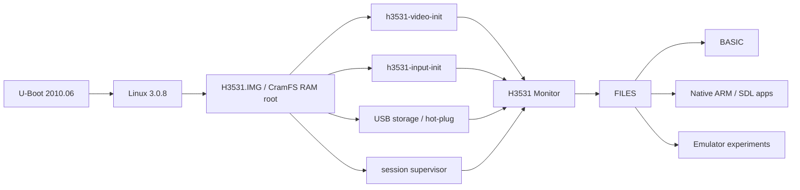

<div align="center">

# H3531 Home Computer

### Turning an obsolete HiSilicon Hi3531 DVR into an experimental Linux home computer

**USB/RAM boot · own Monitor · FILES · BASIC · native ARM/SDL apps · emulator experiments**

[Русская статья](docs/articles/h3531-home-computer-ru.md) · [Быстрый запуск](docs/quickstart-v0.7-fbzx-z80-ru.md) · [Release notes](docs/releases/v0.7-fbzx-z80-demo.md) · [Техническая документация](docs/AHB70XXT16-3531_Hi3531_Technical_Documentation_RU_v3.docx)

</div>

<p align="center">
  
</p>

## Что это

**H3531 Home Computer** — эксперимент по превращению морально устаревшего DVR на плате **AHB70XXT16-3531 / HiSilicon Hi3531** в небольшую открытую компьютерную платформу.

Цель проекта — не сделать «новый ZX Spectrum». Мы исследуем, насколько далеко можно уйти от заводского назначения регистратора: безопасно загружать собственную Linux-среду из USB/RAM, управлять HDMI framebuffer, использовать обычные USB-клавиатуру/мышь/накопитель, запускать BASIC, нативные ARM/SDL-программы и разные эмуляторы.

> **Главное правило разработки:** не использовать `saveenv` и не прошивать экспериментальные образы в SPI. Все текущие эксперименты построены вокруг безопасной USB/RAM-загрузки.

## Что уже работает на реальной плате

- Linux 3.0.8 / ARMv7 на Hi3531.
- Собственный видеотракт: `MPP -> VO -> HDMI -> HIFB -> /dev/fb0`.
- Full-screen framebuffer **1280×720, 16-bit A1R5G5B5 / ARGB1555**.
- USB keyboard, mouse, mass storage и USB hub.
- Собственный **H3531 Monitor** и файловый менеджер **FILES**.
- Tiny BASIC, Bywater BASIC 3.20 и графический Matrix Brandy BASIC VI.
- Собственный SDL 1.2 backend для H3531.
- Нативные ARM/SDL-приложения.
- Exec-based handoff: графическое приложение эксклюзивно получает экран и input, после выхода Monitor запускается снова.
- Windows **Boot Kit 0.7**: автоматическая остановка U-Boot, RAM-загрузка и полноценный UART terminal.
- Эксперимент с **FBZX 3.1.0**: `.Z80` snapshot открывается прямо из FILES и запускается на реальном железе.

## Реальные фотографии

<p align="center">
  
  
</p>

<p align="center">
  
  
</p>

*Все фотографии выше сделаны на реальном H3531-устройстве. Эмуляция ZX Spectrum здесь — только один из экспериментов и один из классов приложений, а не конечная цель проекта.*

## Архитектура



Графические приложения запускаются через **exec session handoff**. Monitor заменяется приложением, поэтому не перерисовывает framebuffer и не читает input одновременно с ним. После завершения приложения supervisor запускает свежий Monitor, а FILES может восстановить предыдущую позицию.

## Быстрый запуск текущего публичного демо

Подготовьте FAT32 USB-флешку со следующей структурой:

```text
/
├── zImage.img
├── H3531.IMG
├── FBZX.APP
├── keymap.bmp
├── spectrum-roms/
│   ├── 48.rom
│   └── if1-2.rom
└── Games/
    └── game.z80
```

`48.rom`, `if1-2.rom` и игры в репозиторий не входят — пользователь добавляет их самостоятельно с учётом применимых авторских прав.

Безопасная ручная RAM-загрузка из U-Boot:

```text
usb start
fatload usb 0:1 0x82000000 zImage.img
fatload usb 0:1 0x83000000 H3531.IMG
setenv initrd_high 0xffffffff
setenv bootargs mem=130M console=ttyAMA0,115200 root=/dev/ram0 rootfstype=cramfs ro mtdparts=hi_sfc:512K(boot),4M(romfs),5632K(usr),1536K(web),3M(custom),256K(logo),1280K(mtd)
bootm 0x82000000 0x83000000
```

После запуска H3531 Monitor откройте `FILES`, перейдите в `Games`, выберите `.Z80` и нажмите **Enter**. Текущий физически подтверждённый публичный сценарий — именно запуск `.Z80` snapshot.

Подробно: **[Quick Start на русском](docs/quickstart-v0.7-fbzx-z80-ru.md)**.

## Из чего состоит проект

```text
h3531-input-init
        ↓
h3531-video-init
        ↓
storage / hot-plug
        ↓
session supervisor
        ↓
h3531-monitor
        ↓
FILES → BASIC / native apps / emulator experiments
```

Исходный код собственного SDL 1.2 backend находится в [`ports/sdl12`](ports/sdl12). Документация по исследованию железа, загрузке, framebuffer, Monitor и истории проекта находится в [`docs`](docs).

## Куда развиваться дальше

В планах — другие эмуляторы старых компьютеров и игровых систем, дальнейшая оптимизация графики, улучшение PC-friendly клавиатуры, звук, более удобная работа с носителями и расширение набора нативных приложений. Поддержка дополнительных форматов образов для эмуляторов рассматривается как дальнейшая работа, а не как уже доказанная функция.

## История проекта

Подробный рассказ — от reverse engineering заводского DVR до собственного Monitor, BASIC, SDL и первых сторонних программ — находится здесь:

### **[Читать статью: как старый DVR стал H3531 Home Computer](docs/articles/h3531-home-computer-ru.md)**

## Для продолжения разработки

Перед новой инженерной сессией см. [`docs/CHAT_HANDOFF.md`](docs/CHAT_HANDOFF.md).

---

This repository contains project-owned source code, patches, build scripts, tests and documentation. Vendor firmware/SDK material is not committed unless its redistribution terms are known to permit it.
